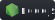

# NodeJS-exercises

### Steps:

<ul>
<li>Install Node.js</li>
<li>Clone or download this repo</li>
<li>"npm install" to have up to date all the dependencies you need</li>
<li>"npm start" to see the project in your local host</li>
</ul>

